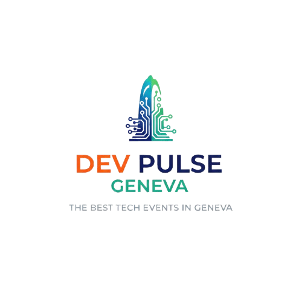

# 🌐 DevPulse Geneva

**La communauté tech de Genève qui pulse au rythme de l'innovation**

DevPulse Geneva est une plateforme dédiée à la communauté des développeurs genevois, proposant des événements, ateliers, hackathons et sessions de networking pour apprendre, créer et se connecter.



## ✨ À propos

DevPulse Geneva rassemble les développeurs passionnés de la région genevoise autour d'événements de qualité :

- 🛠️ **Ateliers techniques** - Approfondissez vos compétences
- 🚀 **Hackathons** - Créez et innovez en équipe  
- 💬 **Talks & Networking** - Partagez et connectez-vous
- 🌱 **Communauté locale** - Une plateforme créée par et pour les développeurs romands

## 🎯 Nos valeurs

- **Innovation** - Encourager l'expérimentation et les nouvelles technologies
- **Partage** - Favoriser l'échange de connaissances et d'expériences
- **Inclusion** - Accueillir tous les niveaux et profils de développeurs
- **Excellence** - Proposer des contenus et événements de qualité

## 🚀 Technologies utilisées

Ce projet est développé avec les technologies modernes suivantes :

- **Framework** : [Next.js 15](https://nextjs.org/) - React framework full-stack
- **Langage** : [TypeScript](https://www.typescriptlang.org/) - JavaScript typé
- **Styling** : [Tailwind CSS 4](https://tailwindcss.com/) - Framework CSS utility-first
- **Animations** : [OGL](https://github.com/oframe/ogl) - Bibliothèque WebGL légère
- **Runtime** : [React 19](https://react.dev/) - Bibliothèque UI moderne

## 🛠️ Installation et développement

### Prérequis

- Node.js 18+ 
- npm ou yarn ou pnpm

### Installation

```bash
# Cloner le repository
git clone [URL_DU_REPO]
cd dev-pulse-geneva

# Installer les dépendances
npm install
# ou
yarn install
# ou
pnpm install
```

### Développement

```bash
# Lancer le serveur de développement
npm run dev
# ou
yarn dev
# ou
pnpm dev
```

Ouvrez [http://localhost:3000](http://localhost:3000) dans votre navigateur pour voir l'application.

### Build de production

```bash
# Créer le build de production
npm run build

# Lancer le serveur de production
npm run start
```

### Linting

```bash
# Exécuter ESLint
npm run lint
```

## 📁 Structure du projet

```
dev-pulse-geneva/
├── public/                 # Fichiers statiques
│   ├── image/             # Logos et images
│   └── *.svg              # Icônes SVG
├── src/
│   ├── app/               # App Router de Next.js
│   │   ├── globals.css    # Styles globaux
│   │   ├── layout.tsx     # Layout principal
│   │   └── page.tsx       # Page d'accueil
│   └── components/        # Composants React
│       ├── HeroSection.tsx
│       ├── WaitlistForm.tsx
│       ├── PrismaticBurst.tsx
│       └── GradientShader.tsx
├── package.json
└── README.md
```

## 🎨 Fonctionnalités

- **Design moderne** - Interface utilisateur élégante avec effets visuels avancés
- **Animations WebGL** - Effets prismatiques interactifs en arrière-plan
- **Responsive design** - Optimisé pour tous les appareils
- **Formulaire de waitlist** - Inscription à la liste d'attente des événements
- **Performance optimisée** - Build optimisé avec Next.js 15

## 🤝 Contribution

Les contributions sont les bienvenues ! Voici comment participer :

1. Fork le projet
2. Créez une branche pour votre fonctionnalité (`git checkout -b feature/nouvelle-fonctionnalite`)
3. Commitez vos changements (`git commit -m 'Ajout d'une nouvelle fonctionnalité'`)
4. Poussez vers la branche (`git push origin feature/nouvelle-fonctionnalite`)
5. Ouvrez une Pull Request

## 📄 Licence

Ce projet est sous licence [MIT](LICENSE).

## 📞 Contact

Pour toute question ou suggestion concernant DevPulse Geneva :

- 🌐 Site web : [À venir]
- 📧 Email : [contact@devpulse-geneva.ch]
- 💬 Discord : [À venir]

---

**DevPulse Geneva** - *Événements pour développeurs à Genève* 🇨🇭
